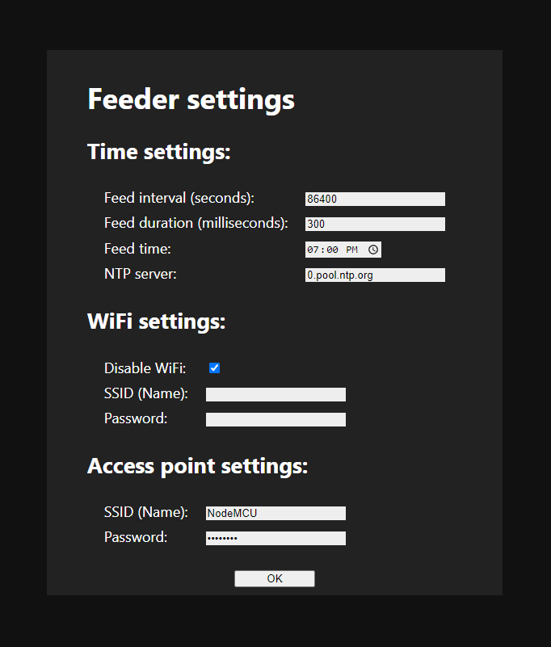

# How to run

## 1. Setting up your environment

I used VS Code + PlatformIO for the development project, although it is possible that you could develop using Arduino IDE.

1. Download VS Code
2. Download the PlatformIO extension
3. Open the project folder in VS Code

## 2. Uploading the filesystem image

1. In your left tabs panel, go to the bottommost icon "PlatformIO"
2. Click nodemcuv2/Platform/Upload Filesystem Image
3. Make sure nothing is using the serial interface in the meantime

## 3. Uploading the code

1. Click Ctrl + Alt + U
2. Make sure nothing is using the serial interface in the meantime
3. If it doesn't work, just try again. If it fails more than three times in a row, disconnect and reconnect the device

# How to use

When you run the device for the first time, it will automatically start a wireless access point. The default settings for it are:

- SSID: NodeMCU
- Password: password

When you enter the network, browse to `10.0.0.1` in your browser. A window like this should pop up:

Now, you need to enter your credentials under the "WiFi settings" section. Don't forget to click on the "Disable WiFi" checkbox. Of course, feel free to change the SSID and password of the access point, just make sure to remember them, or else you need to reflash the device.

Finally, you can connect the device to the servo motor, and connect it to the wall.

NOTE: The algorithm works in such a way that the device will be activated every "Feed interval" seconds since Jan 1th, 1970, at "Feed time". Make sure that "Feed interval" * k = 86400 * n (where k and n are integers).

NOTE2: Don't touch "NTP server", unless you know what you're doing. In 99% of the cases, the default is good enough. If it doesn't work, try any of the following:

- 1.pool.ntp.org
- 2.pool.ntp.org
- 3.pool.ntp.org
- pool.ntp.org
